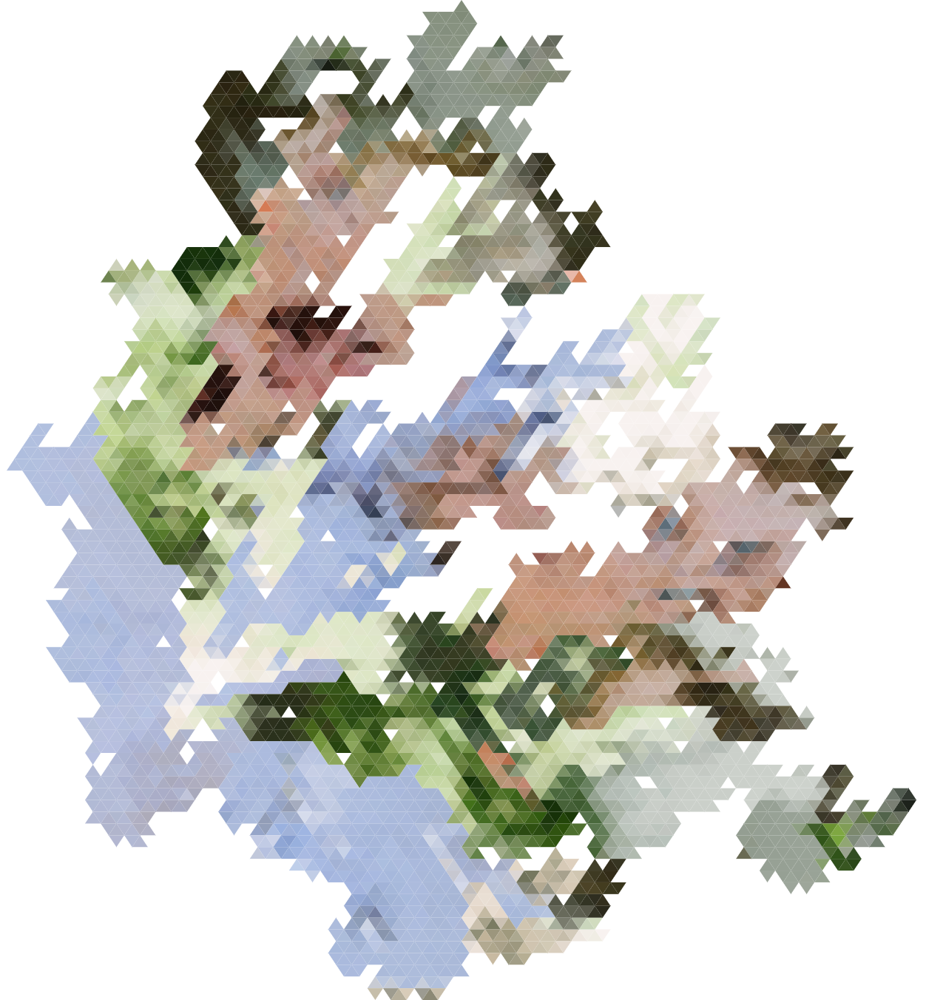

# Equilateral Reproduction



## Usage

```js
var equalRepo = require('equilateral-reproduction');

var imgFilePath = './input.jpg';
var triangles = require('./triangles.json');

var opts = {
  img: imgFilePath,
  triangles: triangles,
  start: 0,
  edge: 5
};

equalRepo(opts, function(err, svg) {
  console.log(svg);
});
```

## Arguments

Equilateral Reporduction takes two arguments. The first is an options object, the second is a callback.

### Options

- img: a file path to the source image
- triangles: an array of triangles where each triangle is an array with a length of there containing point sets like `[x, y]`.
- start: optional, defaults to zero. This is the triangle to start the reproduction with.

While `triangles` MUST not have points that extend past the edges of the provided `img`.

## [Example Source Image](https://www.instagram.com/p/BU2FCbXFOoG/?taken-by=bobbi.jo.brooks)


